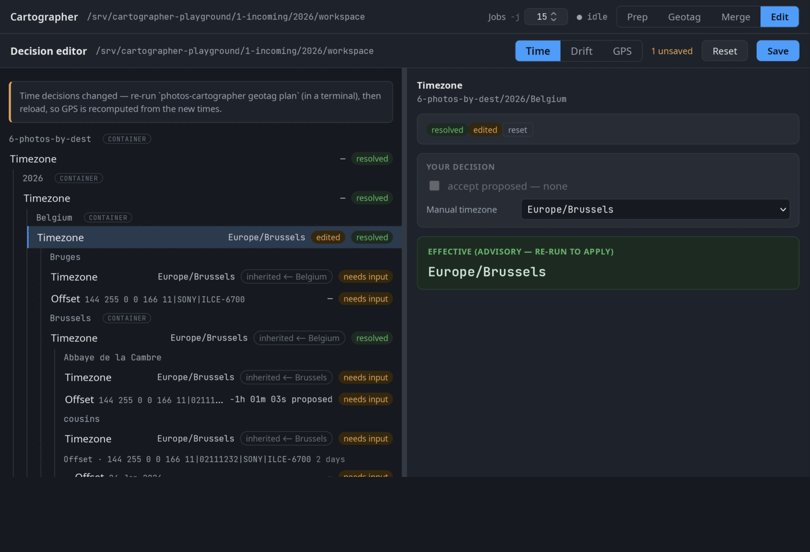

# photos-cartographer

**Put a whole photo library — or a single trip's dump — on the map, with the least manual work.**

*Native GPS where you have it, GPX tracks where they help, minimal, manual cascading fallbacks everywhere else.*

photos-cartographer takes an unorganized dump of photos and videos, cleans and date-organizes it, then
**places every shot on the map** by making the most of every real location it can find: it keeps the
**native GPS** your camera/phone already wrote, **correlates the rest to GPX tracks** — *first inferring and
correcting each camera's clock error automatically*, so a camera set to the wrong timezone or drifting by
minutes still lands on the right point of the track — and **cascades a manual folder-level fallback** over
whatever's left. Even a library with no tracks at all still gets a complete map, from a handful of
manually-set, inherited folder pins. Nothing is deleted and nothing is changed without a plan that can be
inspected first, and **every coordinate it writes is recorded with how it was derived** — native, track
direct-match / interpolated / extrapolated, or manual.

The aim is **100% geolocation coverage for the least possible effort**: every photo placed — precise where the tracks
allow, rough or manual where they don't — so a map view in a library like Immich shows your **whole library**,
not just the frames that came with a location baked in.



*The decision editor: time → drift → GPS.* **▶ [See the full run, step by step →](docs/walkthrough.md)**

It is built for **irreplaceable originals and large batches**: a whole holiday or a years-deep library, several cameras and phones,
thousands of RAW and JPEG frames — resolved in one reviewable pass instead of photo-by-photo, then merged
cleanly into a permanent **folder-based photo library** (digiKam, or anything that reads a plain folder tree).
Almost all of the code that writes time/GPS metadata into photo files — the geotag phase — is exercised by a thorough
automated test suite (figures in [`COVERAGE.md`](COVERAGE.md)), so a change that would misbehave is caught
before it can touch a photo.

> **Searches that might land here:** how to *geotag photos with no GPS from a GPX track*,
> *correlate photos to a GPS track when the camera time is wrong*, *batch/bulk geotag thousands of RAW photos
> non-destructively*, *auto-detect a camera clock offset / timezone for geotagging*, *geolocate a whole
> photo library / put every photo on the map (map-complete library)*, *rough or approximate geotag without
> a GPX track*, *cascading folder-level location*, or a scriptable
> **GeoSetter / HoudahGeo / gpscorrelate / darktable alternative** for an entire trip at once.

## Is it for you? Four choices

It rests on four deliberate choices. Agree with them and it's probably for you; don't, and it isn't — simple.

1. **Photos are irreplaceable, so they deserve care** — no original is ever lost or silently altered;
   correctness beats convenience.
2. **A local, owned, folder-based library** — a plain directory tree on disk (digiKam, Immich, anything
   that reads folders), not a cloud service or a proprietary catalog.
3. **Ask only what the data can't settle** — everything derivable is resolved automatically; you're asked
   only the human judgment calls that are absolutely needed, each made easy to answer.
4. **Every photo on the map, even when GPS is scarce** — precise where the tracks allow, rough or manual
   where they don't; a *map-complete* library, not just the frames that came with a pin.

The reasoning — and the architecture these four force — is **[Who is this for?](docs/who-is-this-for.md)**.

## How it works in one minute

A clean **prep → geotag → merge** pipeline built around the one decision only you can make. Geotag resolves
everything *it* can on its own, in an order chosen so each supplied answer unlocks the most automatic work
downstream:

1. **Prep** — consolidate the dump, normalize extensions, detect duplicates (quarantined, never deleted), and
   date-organize everything.
2. **Sort** *(the one step only you can do)* — drag photos from `5-photos-by-date` into a destination tree
   (`2026/France/Paris/Louvre`, …). This isn't just tidiness: a photo's destination decides its **timezone**,
   its **clock-offset correction**, its **GPS fallback**, and **where it lands in the library** — so a wrong
   folder means a wrong time or place. A `prep` re-run after sorting is **mandatory** (it recognizes the moves,
   stat-only, so geotag sees them). Then geotag takes over:
3. **Timezone** — establish each destination's timezone, from the photos' own evidence where possible,
   otherwise asked **once** and cascaded down the folder tree.
4. **Clock offset** — infer each camera's clock error by matching its already-located frames against the GPX
   track, then solve the rest from that. A wrong-timezone or drifting clock is corrected automatically; only
   the cameras the data can't disambiguate need a confirmation.
5. **Place** — geotag every frame the track can cover: **direct matches**, **interpolation** between track
   points, and **bounded extrapolation** off the ends. Each write is tagged with its method.
6. **Remainder** — whatever no evidence can locate is collected into a short, explicit worklist: place it by
   hand, or inherit a destination's **manual folder-level fallback**, so nothing is left off the map.
7. **Merge** — move the finalized set into the permanent folder-based library, with a full transformation log.

Every run is a **plan that can be dry-run and inspected**; only a validated plan ever writes. Re-runs act on
the diff and are resumable after a crash.

## Documentation

- **[Is this for you? — and why it's built this way](docs/who-is-this-for.md)** — the seven roots (three
  facts about photos, four design choices) and the architecture they force. Read it **forward** to decide
  fit, or **down** to see the design rationale. Start here if you're weighing whether the tool matches your
  situation.
- **[See it work (walkthrough)](docs/walkthrough.md)** — the **full run end to end, in screenshots**: prep →
  sort → geotag's time → drift → GPS edit loop → merge, with a flow diagram. Start here to see what it
  actually does.
- **[Quick start](docs/quickstart.md)** — download → prerequisites → the full end-to-end run (prep, sort into
  destinations, the geotag time → drift → GPS loop, execute, merge).
- **[Concepts](docs/concepts.md)** — the *why*: camera groups, per-day clock offsets, the by-dest tree, clock
  offset vs. GPS drift, and what cascades down the folder tree.
- **[Editor guide](docs/editor.md)** — driving the browser decision editor: the three views, validating drift,
  placing GPS, shift-click multi-select, and how edits reset/cascade.

The authoritative behavioral specifications live in [`spec/`](spec/) (see *How it works (the detail)* below).

## Decide in the browser

When the pipeline needs a decision it serves a **small local web app** (`photos-cartographer edit`) — no build
step, no CDN, offline-capable. It shows a worklist of only the open decisions, each with its proposal and the
evidence, and writes your choice into the durable records geotag reads (the **edit → Save → re-run → reload**
loop; it only ever touches the `user_decision` field). Three views: **Time** (timezones, inherited down the
destination tree), **Drift** (scroll a photo along its GPX track until it lines up — the app reads the corrected
clock offset off the track), and **GPS** (place a shot on an interactive map, paste a `lat, lon`, or set one
fallback a whole destination inherits). Clicking on a map and recording every decision in writing are the same
act — and because each re-run re-reads the records, nothing is lost or entered twice.

→ See the **[walkthrough](docs/walkthrough.md)** for the editor in action and the
**[editor guide](docs/editor.md)** for depth.

## Why it's different from GeoSetter, HoudahGeo, gpscorrelate, darktable

Those tools are excellent **interactive correlators**, but they share two assumptions this pipeline removes:

- **They trust the camera clock.** Correlating photos to a GPX track only works if the camera's time is right;
  when it isn't, the offset has to be discovered and typed in by hand, per camera, per trip.
  photos-cartographer **infers the offset automatically** — it matches a camera's already-geolocated or
  anchored frames against the track and solves for the clock error, then geotags the rest from that.
- **They work one import, one photo, one map-click at a time.** This pipeline is **batch, plan-driven, and
  safety-first**: it plans the whole job, allows a dry-run of the exact operations, and only then writes —
  never overwriting an original, always reversible by design.

If the offsets are already known and clicking each photo onto a map is fine, the classic tools are great. For
a pile of mixed-clock photos that need *correct placement with the least possible effort*, that is what this
is for. → For the **full tool-by-tool comparison** (HoudahGeo, GeoSetter, Geolignment, gpscorrelate,
darktable, exiftool, Lightroom, cloud), see **[How this compares](docs/comparison.md)**.

**Still deciding?** [Who is this for?](docs/who-is-this-for.md) distills it to the fewest questions that
settle fit — three facts about photos, four design choices — and traces the architecture they force.

## Designed to ask for the least

It treats geotagging as a **constraint-propagation problem**: resolve everything the data can, then ask only
for the **minimal set of human decisions** — *ordered so each answer unlocks the most automatic work
downstream*. Timezone first (often from the photos themselves), then infer each camera's clock offset against
the tracks, then place everything placeable, then a short worklist of the true remainder. Decisions are
**reused, not re-asked**: a value set on a parent destination **cascades** to its children unless overridden,
and manual coordinates/offsets are remembered across re-runs. So one well-placed answer high in the tree can
let the pipeline solve every camera on its own — and **leaving a cell untouched *is* accepting it**, so the
common case costs zero clicks. → **[Concepts](docs/concepts.md)** for the full model.

## Safety: non-destructive and traceable

Photos are irreplaceable, so the whole design is **plan → validate → execute**:

- **No mutation outside a plan.** Planning never touches files; execution applies only a validated plan whose
  preconditions still hold. **The dry-run *is* the real plan**, serialized and shown — not a separate simulation.
- **No clobber; quarantine, not delete.** No operation overwrites existing media; duplicates move to a
  recoverable quarantine, never auto-removed.
- **Idempotent & resumable.** Re-runs act only on the diff; a crash mid-run is recoverable; already-placed
  files are recognized and skipped.
- **Stable identity.** Each photo's identity is a decoded-pixel fingerprint, invariant under in-place metadata
  writes and renames — so its full history stays attached across every transformation.
- **Reversible & traceable.** A pre-state ledger remembers what each file held before a manual override, so a
  decision can be withdrawn; and finalize writes a per-photo **journey log** — every clock offset, resolved
  UTC, timezone, GPS method (native / GPX direct-match / interpolation / extrapolation / manual) and rename,
  each linked to the decision that caused it, carried forward by merge with the final library path.

## How it works (the detail)

The pipeline is **specification-driven** — behavior is defined by the documents in
[`spec/`](spec/), and the code follows them. Start with
**[`spec/README.md`](spec/README.md)** for how the specs are organized and the spec discipline, then the
shared contract and the per-phase specs:

| Document | Scope |
|---|---|
| [`photos-1-prep-workflow.md`](spec/photos-1-prep-workflow.md) | **Phase 1 — prep:** consolidation, extension normalization, dedup/quarantine, date-organization, cache/handoff. |
| [`photos-2-geotag-workflow.md`](spec/photos-2-geotag-workflow.md) | **Phase 2 — geotag:** timezone resolution, automatic camera-clock-offset inference, and track-based GPS placement. |
| [`photos-3-merge-workflow.md`](spec/photos-3-merge-workflow.md) | **Phase 3 — merge:** safe merge of the finalized working set into the permanent folder-based library. |
| [`photos-shared-contract.md`](spec/photos-shared-contract.md) | Facts all phases share: the run lock, the `.photos-ingest/` control directory, `photos-00-config.json`, formats, `gpx_root`, and the end-to-end operator loop. |

## Requirements

The pipeline is **Python 3** and shells out to a few standard command-line tools (it doesn't bundle them):

- **exiftool** — reads and writes photo time/GPS metadata (run as a persistent `-stay_open` worker).
- **ImageMagick** (`magick` / `identify`) — the decoded-pixel fingerprint that gives each photo a stable
  identity across metadata writes and renames, plus the editor's photo previews.
- **ffmpeg** — the stream fingerprint used to date-organize and de-duplicate videos.

SQLite (the cache and decision database) comes in through Python's standard library, so there's nothing extra
to install for it. **ZFS** is optional: when configured, the pipeline can take a pre-mutation snapshot before
any write, but the safety model — journal, recoverable quarantine, no-clobber, filesystem-as-truth — stands on
its own without it. The decision editor vendors its front-end (Leaflet — no CDN, no build step);
its map tiles and place search use OpenStreetMap/Nominatim at runtime and degrade gracefully offline.

## Layout

- `cartographer/` — the pipeline package: `photos_1_prep.py` / `photos_2_geotag.py` /
  `photos_3_merge.py` (the three phases) + `photos_utils.py` (shared `CONFIG` + utilities) + `cli.py`
  (the combined `photos-cartographer` entry) + `editor/` (the locally-served Time/Drift/GPS decision app — a map-based web UI — that drives the worklist above) + `console/` (the operational web console: run and monitor every phase from a browser over the cwd workspace).
  Run a phase with `python3 -m cartographer <phase> <subcommand>` (from the repo root),
  or build the self-contained `photos-cartographer` zipapp with `tools/build-pyz`.
- `spec/` — the authoritative specifications. `tests/` — the test suite.
  `tools/` — build + test helpers. `.githooks/` — pre-commit / pre-push.

## Tests and coverage

The geotag phase — the one that writes time and GPS into irreplaceable originals — is the most heavily
tested (~98% line / ~97% branch). Coverage is tracked on two axes — line/branch and **spec-clause**
(which behavioral clauses in `spec/` have a dedicated test) — both reported in **[`COVERAGE.md`](COVERAGE.md)**.

Run the suite from the repository root (`conftest.py` puts the repo root on `sys.path`):

```bash
python3 -m pytest -q
```

See `AGENTS.md` for the full build/test/CLI contract and the seeded config defaults.

## Why this exists

I built this after years of frustration with geotagging photos by hand: typing in offsets, clicking shots onto
a map one at a time, and still ending up with gaps. It does the tedious parts automatically and asks only for
what it truly can't work out, so geotagging a whole trip stops being a chore. It's made first for my own
archive and shared as-is, in case it's useful to anyone with the same problem.

## License

Apache License 2.0 — see [`LICENSE`](LICENSE) and [`NOTICE`](NOTICE). The bundled Leaflet library keeps
its own BSD-2-Clause license (`cartographer/editor/web/vendor/leaflet/LICENSE`).
