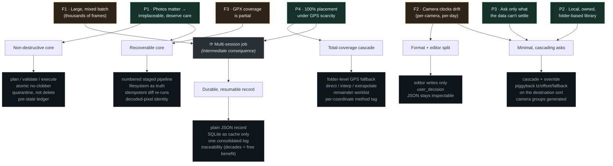
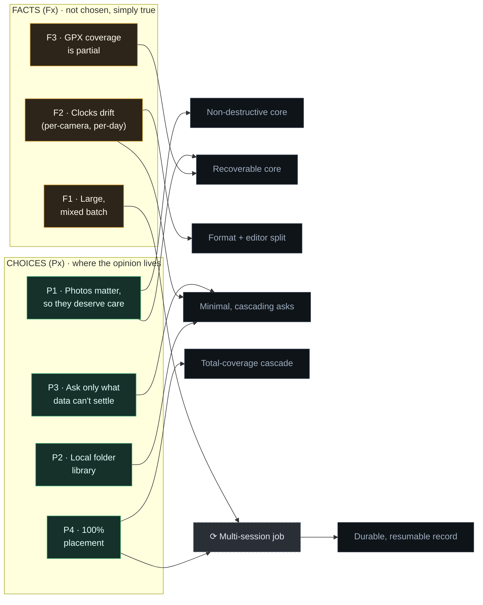

# Who is this for?

*The fewest questions that settle one thing — who the tool is for — and, traced downward, the
same roots are the design explained. Read them forward to decide fit; read them down to see why
it is built this way.*

---

> Where this comes from: twenty years of luggage made me build it.

---

## What this is

The structure here — the numbered folder workspace, the JSON files, the mandatory re-prep, the
plan/validate/execute ceremony — is not a pile of independent preferences that each could have gone
another way. It all springs from a few roots, and the point of laying them out is economy: the
**smallest set of questions that settles fit**, nothing padded in, so the matter can be decided
fast and the rest read — or skipped — on that basis.

Almost none of the details below is an independent choice. They are a single entailment fanning
out from a small number of root commitments — the roots are what is open to debate; the rest
follows from them. **If one accepts the roots, the architecture is largely not negotiable; if one
rejects them, one is simply not the intended user — and in neither case are the downstream details
the place to start.**

So this is where the project's opinions actually live: a few high-level commitments, stated
plainly below, and then the chain by which each forces the engineering visible in the code and
the specs.

---

## The root layer: three facts, four choices

Before any choices, three **facts** (`Fx`) about photos — awkward, under-named, and almost
certainly already familiar even if never filed as a *kind* of problem. The recognition is the
point: these are potholes, not opinions one has to adopt.

**Facts (`Fx`):**

| # | Fact | What it means | Where one has met it |
|---|------|---------------|---------------------|
| F1 | **A batch is large — thousands of frames, several cameras.** | A trip dump or a years-deep library is big and mixed: many RAW/JPEG frames across multiple cameras and phones. | The card one keeps meaning to deal with; the decade of folders; or *"I'll geotag these someday."* |
| F2 | **Camera clocks drift — independently, and from day to day.** | Each body's clock is wrong by its own amount, and that amount changes between days (drift, manual resets to local time in the morning, missed DST). There is no single global offset to find. | The import that landed an hour early; the shots an hour off after a border; a day's frames scattered because the clock was never set — blamed on negligence or forgetfulness, not on a category. |
| F3 | **GPX coverage is partial.** | The logger's tracks reach *some* of the library, never all of it — so the track alone can never place every frame; the rest needs fallbacks. | The half-tagged library; the map view with holes where phone-sync missed; the frames that came with a pin and the many that didn't. |

Then, given those facts, four **choices** (`Px`) — the arguable part, where a different author
could have gone another way. These are the part one can argue with.

**Choices (`Px`) — the whole of the opinion:**

| # | Choice | Kind | What it commits to |
|---|--------|------|--------------------|
| P1 | **Photos matter; they are irreplaceable, so they deserve care.** | Value | Because they matter, no original may be lost or silently altered — correctness beats convenience. |
| P2 | **A local, owned, folder-based library.** | Choice | The destination is a plain directory tree on disk (feeds digiKam or Immich), not a cloud service or proprietary catalog. |
| P3 | **Ask only what the data can't settle.** | Design value | Resolve everything derivable automatically; ask only real judgment questions, and make each one cheap to answer. |
| P4 | **100% placement, even under GPS scarcity.** | Goal | Every photo ends up on the map — precise where tracks allow, rough or manual where they don't — so the result is a *map-complete* library, not just the frames that came with a location. |

The forcing is *conditional* determinism: **given these roots, the design follows.** The three
facts (`Fx`) are not chosen at all, they either apply or not; the four choices (`Px`) are opinions.
And yes — this is opinionated software, by design and gladly so: not fifty scattered preferences,
but seven load-bearing roots — three merely true, four chosen — and their inevitable consequences.
A few strong opinions, each one carrying weight, are the whole of it.

**If these roots aren't a match, stop here.** Everything below is only their consequence; the rest
is nothing but these roots followed down. The **facts** (`Fx`) are not up for disagreement — clocks
drift, batches are large, coverage is partial — but they may simply fail to reach a given case:
someone shooting only a phone, a handful of frames, or a track that already covers everything has
a situation these facts don't touch, and this script does not apply. The **choices** (`Px`) are a
different matter — those are values, and people may hold others: a cloud library over an owned
folder tree, or no appetite for a plan-driven pipeline. Disagree with a choice and the script again
is useless. Applicability for the facts, assent for the choices — fail either and the
conclusion is this was built for someone else.

> **Note on what is *not* a root.** "The decisions are complex" and "the decisions are
> far-reaching" might look like facts to put here. They are not. **Complexity is derived** —
> it follows from F2 (drift that is per-camera and per-day is what makes the correct answer
> intricate). **Reach is chosen** — a decision is far-reaching only because the cascade makes
> it so, and that is a deliberate trade under P3: *one far-reaching decision in place of many
> short-reaching ones.* Both appear below as consequences, not premises.

> **Note on non-roots: Linux and open-source.** This is built and run on Linux, but Linux is
> not a root — the design is plain Python shelling out to `exiftool`, ImageMagick, and `ffmpeg`,
> all cross-platform, so it would port with little structural change. It is where the tool
> *lives*, not a premise the architecture leans on. Open-source is likewise a downstream
> expression of the "local, owned" ethos (P1, P2), not a structural driver. Neither forces
> anything below.

---

## The entailment: premise → forced consequence → concrete mechanism

Each row is a chain. The right-hand column is what actually appears in the repo; the middle
column is *why it could not reasonably be otherwise* given the premise.

### From P1 — irreplaceable originals

| Forced consequence | Concrete mechanism in the code/specs |
|--------------------|--------------------------------------|
| No mutation outside a validated plan | **plan → validate → execute**; the dry-run *is* the serialized plan; stale plans are rejected against current state |
| Safety cannot rest on the plan being correct | No-clobber **re-verified atomically at the moment of each write**, not just at plan time |
| Deletion is never automatic | Duplicates are **quarantined**, never removed; pruning is an explicit, separate act |
| A decision must be withdrawable | A **pre-state ledger** records what a file held before a manual override, so deleting the decision *restores* the prior state |

### From F2 + P3 — drift makes the decisions intricate; P3 keeps them cheap

Start with the fact. Because each camera's clock is wrong by its own amount, and that amount
changes from day to day (F2), there is no single offset to discover — the correct answer is
**per (camera group, destination, day)**. *That* granularity is the entire source of the
decisions' "complexity": it is a consequence of real, time-varying drift, not a premise. Such
intricacy would be brutal to enter by hand, so P3 (ask only what the data can't settle) governs
how it is collected — and introduces the document's central trade.

| Forced consequence | Concrete mechanism |
|--------------------|--------------------|
| Drift is per-camera and per-day, so no global offset is correct | The offset is **inferred and applied per (camera group, destination, day)**; corrections fall *between* destinations, never within one — which is why **one destination = one coherent shoot** |
| Intricate, evidence-specific decisions are too error-prone to hand-edit | **Format + editor split**: JSON is the record; the Time/Drift/GPS app is what writes it |
| The record must stay an honest statement of *intent*, not a mutable scratchpad | The editor writes **only the `user_decision` field** — never derived or evidence fields |
| Asking per-photo would be thousands of short-reaching chores | Decisions **cascade**: *one far-reaching choice high in the tree is traded for many short-reaching ones* — inherit unless overridden, remembered across re-runs. (This is where "far-reaching" comes from — a chosen trade, not an inherent property.) |
| Inheritance needs an axis to travel along | The destination tree must be a **hierarchy** — the cascade rides on folder nesting, so a flat or tag-based layout can't inherit at all, and every value would fall back to per-photo entry |
| The unavoidable human act should pay for itself | Timezone, clock offset, and GPS fallback are **piggybacked on the destination sort** one would do anyway for real albums (P2) |
| The tedious part of a judgment call should be pre-computed | **Camera groups are generated for the user**, ready to paste — leaving only the judgment, not the derivation |

### From P1 + F3 — recoverable, and resumable on incremental input

Crash-recovery follows from P1 (an interrupted run must never strand an original half-changed);
the diff-based idempotency also answers F3 — because coverage is partial, one adds more tracks or
photos later and re-runs, so a run must act only on what actually changed.

| Forced consequence | Concrete mechanism |
|--------------------|--------------------|
| A crash must be recoverable | **Discrete, inspectable stages** (the numbered pipeline) — each a real checkpoint; the **filesystem is treated as truth** |
| Re-runs must not redo settled work or cause churn | **Idempotent, diff-based** re-runs; a run over unchanged state is a no-op |
| Identity must survive EXIF rewrites and renames | A **decoded-pixel fingerprint** (ImageMagick/ffmpeg), not file bytes, as each photo's stable identity |

### From P4 — total placement under GPS scarcity

This choice fights F3: tracks cover only *part* of the library, but the output must be *whole*. That gap is what forces the fallback machinery to exist: without P4, tracks alone would be the entire story and everything below would be unnecessary.

| Forced consequence | Concrete mechanism |
|--------------------|--------------------|
| Placement cannot depend on the track alone | A **cascading folder-level GPS fallback** — set one coordinate at a trip's root and it is inherited down the tree (P3 makes this cheap; one answer covers many photos) |
| The true unplaceable set must be surfaced, never silently dropped | An explicit, short **remainder worklist** — what no evidence can locate is collected for a manual pin, not left off the map |
| Every placeable point of the track must be squeezed out | **Direct match → interpolation between points → bounded extrapolation off the ends**, each used before falling back to manual |
| Completeness means precision now *varies* across the library — so each placement must declare how trustworthy it is (via the **traceability** the multi-session reality forces — see below) | **Every coordinate carries its derivation method** — native / GPX direct-match / interpolated / extrapolated / manual — so a rough pin is never mistaken for a precise one |

### From F1 + P4 — total coverage at scale becomes a multi-session job

This is a **two-level chain**: a fact and a choice together force an intermediate consequence,
and that consequence — not either root directly — forces the record machinery. It is the part
most easily mistaken for an arbitrary choice.

Neither root does it alone. Scale (F1) without the 100%-coverage goal (P4) is fast: prep is
automated, one keeps the native-GPS frames, lets the track cover the easy matches, and stops —
plausibly one sitting, because the long tail is never chased. The goal without scale is also
trivial: placing ten photos completely takes minutes. Only the **product** — total coverage
*across a large, mixed batch* — produces a long tail of per-(camera, destination, day) offset
confirmations and hand-placed remainder that cannot be finished in one sitting.

Note: not all of that elapsed time is P4's. The album **sort** into a destination tree is owed
to **P2** — one would drag photos into folders even with no geotagging at all — so P2 contributes
session-spanning human time on its own. What F1 + P4 *specifically* add is the **long tail of
confirmations and manual placement** that has no automated escape. Either way, the job spans
multiple sessions.

**Intermediate consequence — a multi-session job.** The machine cannot hold one's decisions in
its head between sittings. That, in turn, forces the record machinery — and note what is *not* a
driver here: auditability and decade-longevity, are **zero-cost benefits** that fall out of
building for resumability.

| Forced consequence (of the multi-session reality) | Concrete mechanism |
|--------------------|--------------------|
| Decisions can't live in the tool between sessions, so they must persist outside it | **Plain JSON** decision artifacts — the durable external record, read back at the start of each session |
| Resuming must not mean re-deciding | Decisions are **idempotently re-read each run**; the fast store is **SQLite as a cache only** — derived, rebuildable, never the source of truth |
| A choice made weeks earlier must still explain itself on return | A **consolidated, self-describing log in one kept folder** — *traceability arrived at, not chosen* (and it is this traceability that lets the provenance tag above mean anything) |
| *(zero-cost benefit)* Built to survive a three-week gap, it survives a thirty-year one | Decade-longevity and "open one folder years later" come free — incidental, never the driver |

---

## The shape of the forcing, in one picture

Only the seven roots are independent; everything below the first rank is entailment.
Green = chosen, amber = given.

---

## What is *not* forced (the honest residue)

Not everything is forced. This is what remains real engineering judgment — places where someone
could have chosen differently and the premises would not have objected:

- **The exact decomposition into seven stages** rather than six or eight. The *principle* of
  discrete inspectable checkpoints is forced (P1+F3); the specific cut points are judgment.
- **The consensus-clustering details** of clock-offset inference — clustering rather than
  averaging is forced by robustness, but the spread thresholds, the tie-breaks, and the
  confidence grades are tuned choices.
- **The downstream library, not the tree.** A *hierarchical* destination tree is **forced**,
  not chosen: the timezone / offset / GPS-fallback cascade rides on the folder nesting, so a
  flat or tag-based layout would make inheritance impossible and drive the per-photo workload
  straight back up. What is actually free is only *which* folder-based library consumes the
  result — digiKam, or any other — and the cosmetic naming of the levels.
- **Defaults that are offered, not imposed.** Folder names (`0-sources … 6-photos-by-dest`)
  are configurable, not hardcoded — the seven-stage *structure* is the invariant, the *labels*
  are the operator's. This is the clearest evidence that the rigidity is structural where it must
  be and accommodating where it can afford to be.

These are real choices but only details.

---

## Using this document

When a specific design decision looks surprising, trace it up. If it lands on a root, that root is
where the conversation belongs. If it lands in the residue above, it is fair game for ordinary
debate. (The other use — deciding whether the tool fits at all — is settled earlier, at the roots:
recognise the facts, share the choices, or stop.)

This document is the **roots and rationale**; for the **mechanics** they produce — camera groups,
per-day clock offsets, the by-dest tree, what cascades — see [Concepts](concepts.md). For where the
existing tools sit relative to these roots — and why the niche is empty — see
[How this compares](comparison.md).

The strictness buys safety on irreplaceable originals and an audit trail that outlives the software —
a handful of clear commitments, with everything else following as consequence.

---

## The dependency graph: what's chosen, what's true, what follows

The same structure once more, sorted by *kind* rather than by mechanism. On the left, the whole
of the opinion — four **choices** (`Px`). On the right of them, three **facts** (`Fx`)
that no one gets to choose at all. Both feed the **forced consequences**, and exactly one of those
consequences (*multi-session*) is itself a cause, feeding the record machinery downstream of it.
Read it and the headline is plain: of seven roots, only four are arguable, and the rest of the
system is entailment.

*Green = chosen (the arguable part). Amber = given (the facts). Grey = what they force. The
dashed node is the one consequence that is also a cause.*

